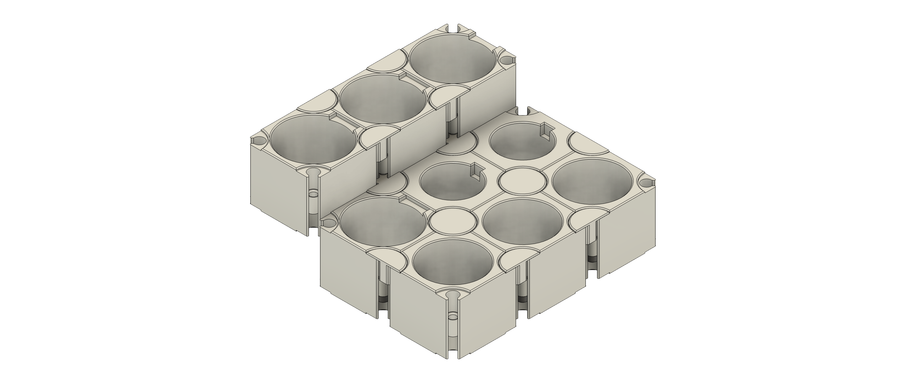
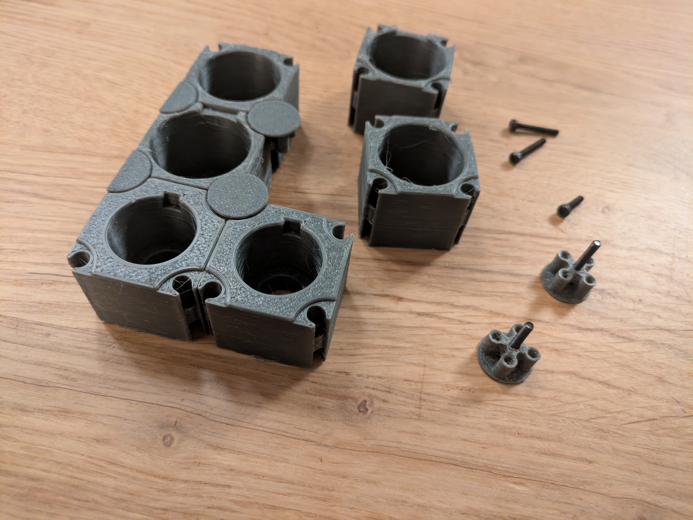
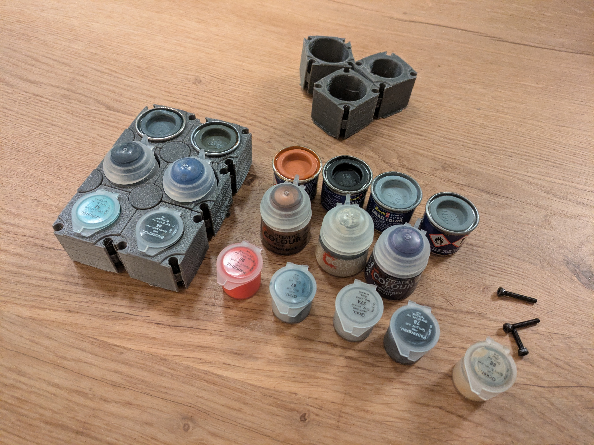
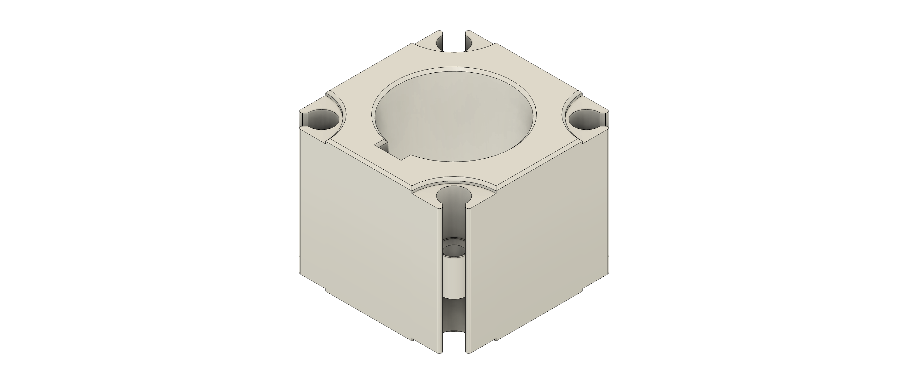
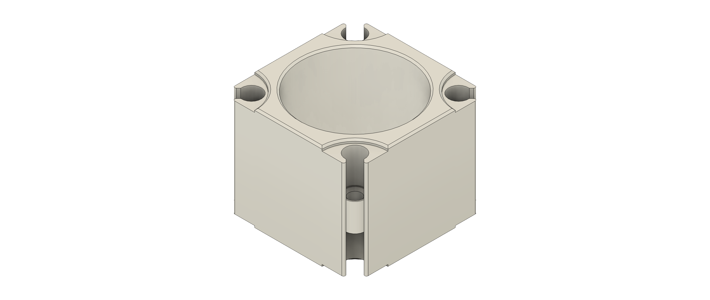
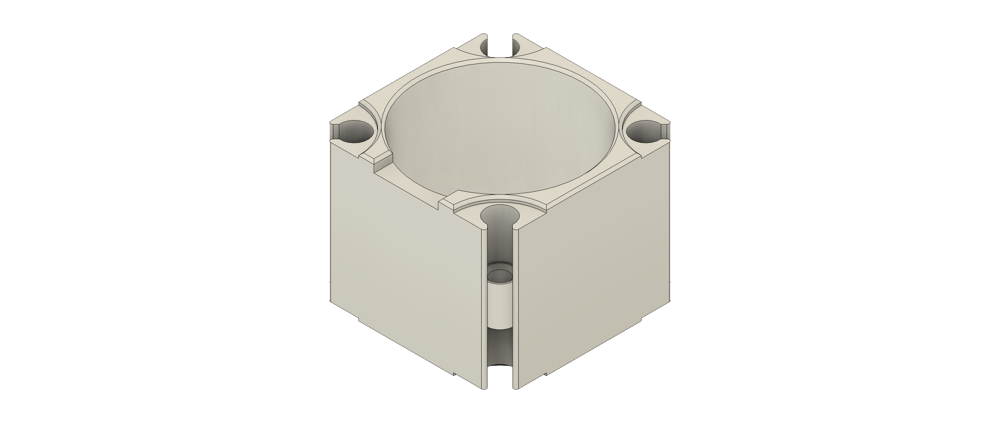
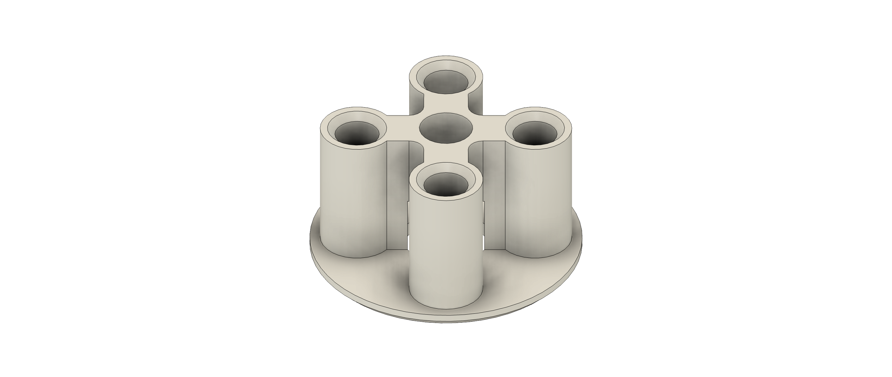
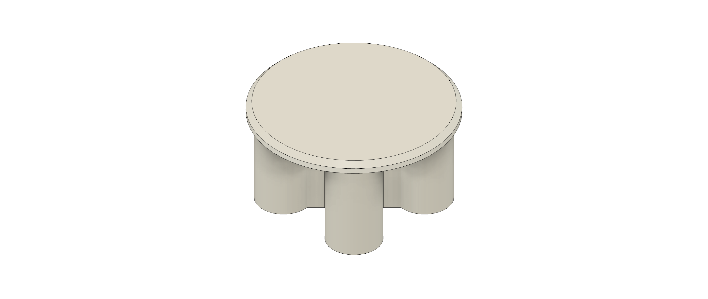
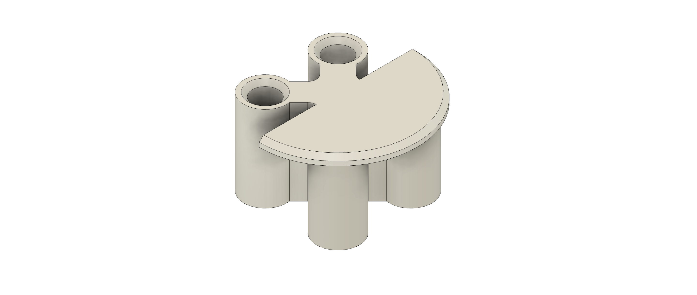
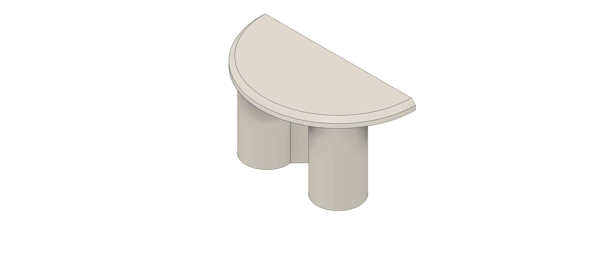

# Universal Modular Paint Holder for Revell and Citadel Paints

A universal, modular design to create a customizable holder for all your model paints from common manufacturers such as Revell and Citadel.

## Table of Contents
- [Overview](#overview)
- [3D Printed Parts](#3d-printed-parts)
- [Standard Hardware](#standard-hardware)
- [Assembly](#assembly)
- [Development](#development)
- [License](#license)
- [Authors](#authors)

## Overview

- Can be expanded as needed
- Consists of modules that can be combined freely
- Pre-made modules for common paint types such as Revell, Revell Email Color, or Citadel Color
- Paints can be arranged in multiple levels
- Stable construction through screw connections

| Example 1 | Example 2 | 
| --------- | --------- | 
|  |  | 

## 3D Printed Parts 

Refer to the `print/stl/` and `print/png/` folders for all printable parts and preview images.

| Filename | Thumbnail | Notes |
| -------- | --------  | ----- | 
| `./print/stl/revell_color.stl`          |  | Revell Color |
| `./print/stl/revell_email_color.stl`          |  | Revell Email Color |
| `./print/stl/citadel_color.stl`          |  | Citadel Color |
| `./print/stl/connector_bottom_cap.stl`          |  | Bottom part of connector for 4 paints (fix with M3×25mm screws to 4-paint top cap)|
| `./print/stl/connector_top_cap.stl`          |  | Top part of connector for 4 paints |
| `./print/stl/conector_level.stl`          |  | Connector to mount paints in different levels (fix with M3×20mm screws to two paint top cap)|
| `./print/stl/connector_end.stl`          |  | Two paint top cap (fix with M3×16mm screws) |

### Printing Settings

- Connectors should be printed with the flat top (if present) facing down
- Maximum 20% infill or no infill for paint holders with 2 perimeters to save filament
- 100% infill recommended for connectors
- Supports are only needed for the paint holders at the 1mm deep recesses on the underside where the flat side of the caps sits

## Standard Hardware

- M3×16mm cylinder head screws
- M3×20mm cylinder head screws
- M3×25mm cylinder head screws

## Assembly

- Place as many modules next to each other as needed and connect them using level connectors if desired. 
- Place top caps on adjacent modules at the same level. 
- Screw groups of four from below using the corresponding bottom cap with M3×25mm screws. 
- Screw two adjacent modules at the edge with M3×16mm screws. 
- Screw the level connectors with M3×20mm screws. 

See the video below as an example: 

## Development

Contributions are welcome.
See `CONTRIBUTING.md` for details and follow the `CODE_OF_CONDUCT.md` when contributing.

## License

This project is licensed under the Creative Commons Attribution-ShareAlike 4.0 International License (CC BY-SA 4.0) — see `LICENSE.txt` for details or visit http://creativecommons.org/licenses/by-sa/4.0/

## Authors

- Simon Gerlach <https://github.com/Smenger>

---

If something in this README is missing or unclear, please open an issue in the repository so the instructions can be improved.
